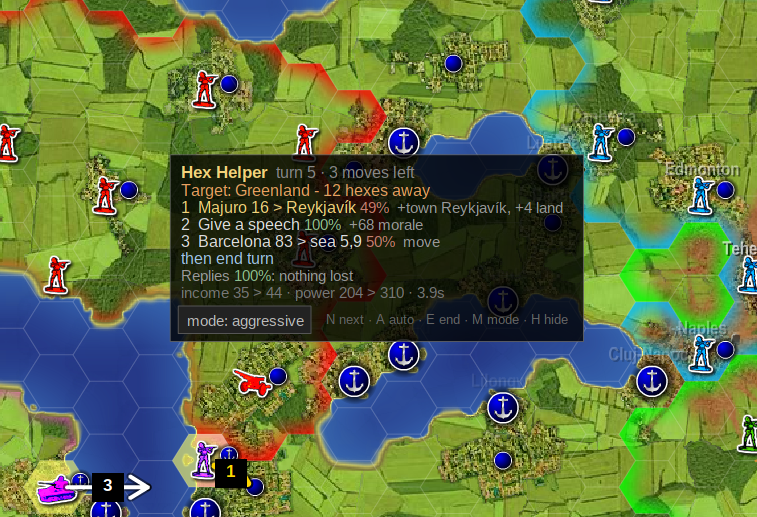

# Hex Helper



This started as a mod I wanted for a Flash game I used to play. Hex Empire, the 2009 turn-based strategy
one where you're a little red (or purple, or blue, or green) nation trying to take over a hex map. I just
wanted a "next best move" hint. It kind of got out of hand.

It turned into an in-game panel that plans your whole turn, draws the moves on the map, tells you
what the enemies are going to do next, and can play the turn for you if you want. It's built on an
exact copy of the game's rules and an exact copy of the game's AI, pulled out of the decompiled game and
checked move for move. After ~52,000 simulated games against the real AI, it wins 84% of Hard games
in normal mode and 92% in aggressive mode. For comparison, the game's own AI playing your side wins
0% of those.

> **The game isn't included.** You need your own copy of `hex_empire.exe` (the Flash projector version).
> The setup script extracts and decompiles it on your machine; nothing from the game lives in this repo.

## What you get

- **A turn plan.** Up to 5 moves as one plan, so it finds combos like softening up a defender with one
  army and finishing it with another. Shows up as numbered arrows plus one line per step, each with a
  confidence %.
- **Enemy predictions.** It replays the enemies' next turn with a copy of their AI and tells you what's
  coming ("Replies 100%: Bluegaria takes Turku"). The % is how right it's been so far in your game.
- **Speech and pact timing.** You only get one of each per game; it figures out when the speech is worth
  it and who to sign the pact with.
- **Aggressive mode.** Picks the nation that's cheapest to wipe out, puts a crosshair on its capital, and
  goes for it, including multi-army assaults where the first armies wear the garrison down.
- **Hover preview.** Select an army, hover a hex, see what that move would do.
- It adapts how hard it thinks to how fast your machine runs it (the panel shows seconds per plan).

### Keys (on your turn)

| key | what it does |
|---|---|
| `N` | play the next step of the plan |
| `A` | auto-play the rest of the plan |
| `E` | end turn |
| `M` | switch normal / aggressive (or click the mode button) |
| `H` | show / hide the panel |

You can drag the panel around by its background.

## Setting it up

You'll need Python 3, Java 11+, `curl` and `unzip`. On Linux/macOS the game runs fine under Wine; on
Windows, run the scripts from Git Bash or WSL and launch the built `.exe` like normal.

```sh
scripts/setup.sh /path/to/hex_empire.exe     # extracts + decompiles your copy (grabs the FFDec decompiler)
scripts/build.sh                             # -> game/hex_empire_hexhelper.exe
wine game/hex_empire_hexhelper.exe
```

Your original `hex_empire.exe` never gets touched, and `game/` and `tools/` are git-ignored.

## How it works (short version)

1. **It rebuilt the rules.** It copies the board into plain arrays and re-implements the game's rules on
   top: movement (sea travel through ports included), combat (fully deterministic, no dice), annexing,
   morale, wiping out nations, spawning troops. `test/fidelity.js` checks it against the game's real
   functions after every single move: 0 mismatches over ~170,000 moves.
2. **It searches whole turns.** A beam search over up to 5 moves (plus speech/pact) scores where each plan
   leaves you: troops, morale, income, what the enemies can take back, what you can hit next turn, and how
   far your armies are from their targets.
3. **It plays out the enemy's turn.** For the 16 best plans it runs every enemy's next turn with a copy of
   the game's AI and keeps the plan that holds up best. The copy matches the real AI exactly, down to how
   Flash's (unstable) `Array.sort` breaks ties, which I had to measure inside the real Flash Player
   ([test/sorttest](test/sorttest/README.md)).
4. **Then it got tuned.** I ran tens of thousands of simulated games, compared settings on the same maps,
   and only kept the winners that held up on maps they'd never seen.

The long version (game mechanics, how the AI decides, what worked and what flopped) is in
[docs/FINDINGS.md](docs/FINDINGS.md).

## What's in here

| path | what it is |
|---|---|
| `advisor/advisor.as` | the mod itself (ActionScript 2), spliced into the game's main script by `build.sh` |
| `scripts/` | `setup.sh`, `build.sh`, `projector.py` (splits/joins Flash projector exes), `sorttest.sh` |
| `test/` | offline test rig: rules check, full games vs the real AI, settings sweeps ([README](test/README.md)) |
| `docs/FINDINGS.md` | mechanics, AI behaviour, results, lessons |

If you want to fiddle with it, the knobs are in the `HWA_W` line at the top of `advisor/advisor.as`. Run
them through `test/arena.js` or `test/sweep.sh` before rebuilding so you know whether a change helps.

## Credits and the fine print

- Hex Empire is © its original authors (Meta:Sauce / Minijuegos). There's no game code or assets in
  here. This repo only describes how the game works and patches a copy you bring yourself.
- Decompiling and recompiling uses [JPEXS Free Flash Decompiler](https://github.com/jindrapetrik/jpexs-decompiler)
  (GPL), which `setup.sh` downloads for you.
- Single-player only. Hex Empire doesn't have multiplayer, so nobody's getting cheated here.
